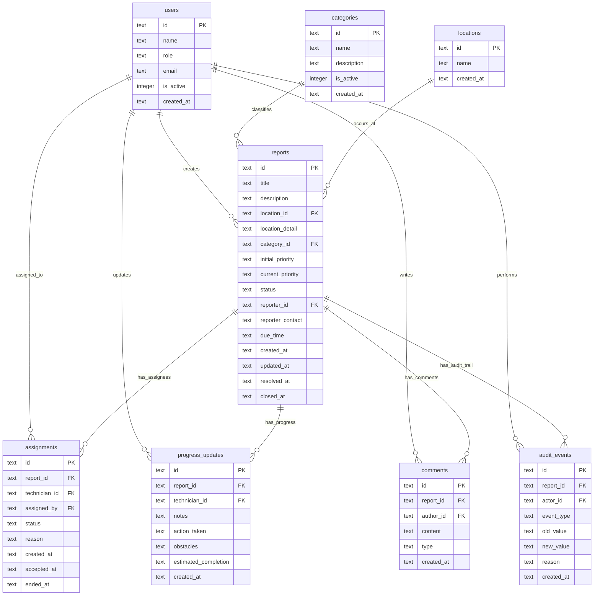

# Database and API Design

## Metadata

| Item | Nilai |
|---|---|
| Proyek | Campus Service Request and Maintenance System |
| Tahap | 07 - Database & API Design |
| Status | **Baseline / Approved** |
| Tanggal | 1 Juli 2026 |
| Upstream | `docs/software-engineering/03-specification.md`, `docs/software-engineering/06-architecture-design.md` |
| Downstream | `docs/software-engineering/08-ui-design.md`, `docs/software-engineering/09-issue-planning.md` |

---

## ERD Summary

Sistem penyimpanan data didasarkan pada model relasional terpusat menggunakan Cloudflare D1 (SQLite). Relasi antar entitas digambarkan melalui diagram Mermaid berikut:



---

## Tables

### DATA-001: `users`
Tabel ini menyimpan daftar pengguna dummy untuk keperluan demonstrasi berbasis peran.

| Field | Type | Constraints | Purpose | Traceability |
|---|---|---|---|---|
| `id` | TEXT | PRIMARY KEY | ID unik pengguna dummy | REQ-022, AC-043 |
| `name` | TEXT | NOT NULL | Nama tampilan pengguna | REQ-022 |
| `role` | TEXT | NOT NULL CHECK(`role` IN ('PELAPOR', 'ADMIN', 'TEKNISI', 'MANAJER')) | Peran otorisasi | REQ-022, BR-003 |
| `email` | TEXT | NOT NULL | Email dummy | REQ-022 |
| `is_active` | INTEGER | NOT NULL DEFAULT 1 CHECK(`is_active` IN (0,1)) | Status aktif pengguna | REQ-008 |
| `created_at` | TEXT | NOT NULL DEFAULT (CURRENT_TIMESTAMP) | Waktu pendaftaran data | REQ-024 |

---

### DATA-002: `categories`
Menyimpan daftar kategori kerusakan fasilitas kampus.

| Field | Type | Constraints | Purpose | Traceability |
|---|---|---|---|---|
| `id` | TEXT | PRIMARY KEY | ID unik kategori | REQ-007, AC-013 |
| `name` | TEXT | NOT NULL UNIQUE | Nama kategori (misal: Kelistrikan) | REQ-001, AC-013 |
| `description` | TEXT | NULL | Deskripsi kategori | REQ-007 |
| `is_active` | INTEGER | NOT NULL DEFAULT 1 CHECK(`is_active` IN (0,1)) | Flag soft delete | REQ-007, BR-006, AC-014 |
| `created_at` | TEXT | NOT NULL DEFAULT (CURRENT_TIMESTAMP) | Waktu pembuatan | REQ-024 |

---

### DATA-003: `locations`
Menyimpan daftar lokasi utama kampus (misalnya: Gedung A, Gedung B).

| Field | Type | Constraints | Purpose | Traceability |
|---|---|---|---|---|
| `id` | TEXT | PRIMARY KEY | ID unik lokasi | REQ-001 |
| `name` | TEXT | NOT NULL UNIQUE | Nama lokasi utama | REQ-001 |
| `created_at` | TEXT | NOT NULL DEFAULT (CURRENT_TIMESTAMP) | Waktu pembuatan | REQ-024 |

---

### DATA-004: `reports`
Entitas utama yang menyimpan informasi lengkap laporan kerusakan.

| Field | Type | Constraints | Purpose | Traceability |
|---|---|---|---|---|
| `id` | TEXT | PRIMARY KEY | ID unik format `REP-YYYYMMDD-XXXX` | REQ-002, AC-004 |
| `title` | TEXT | NOT NULL | Judul laporan | REQ-001, AC-001 |
| `description` | TEXT | NOT NULL | Detail deskripsi kerusakan | REQ-001, AC-001 |
| `location_id` | TEXT | NOT NULL REFERENCES `locations`(`id`) | Referensi lokasi utama | REQ-001 |
| `location_detail` | TEXT | NULL | Detail lokasi spesifik (opsional) | REQ-001 |
| `category_id` | TEXT | NOT NULL REFERENCES `categories`(`id`) | Kategori kerusakan | REQ-001 |
| `initial_priority` | TEXT | NOT NULL CHECK(`initial_priority` IN ('LOW', 'MEDIUM', 'HIGH', 'URGENT')) | Prioritas awal dari pelapor | REQ-001 |
| `current_priority` | TEXT | NOT NULL CHECK(`current_priority` IN ('LOW', 'MEDIUM', 'HIGH', 'URGENT')) | Prioritas terverifikasi admin | REQ-006 |
| `status` | TEXT | NOT NULL DEFAULT 'SUBMITTED' CHECK(`status` IN ('SUBMITTED', 'UNDER_REVIEW', 'ASSIGNED', 'IN_PROGRESS', 'RESOLVED', 'CLOSED')) | Status lifecycle laporan | REQ-002, BR-001, BR-002 |
| `reporter_id` | TEXT | NOT NULL REFERENCES `users`(`id`) | Pembuat laporan | REQ-001, AC-005 |
| `reporter_contact` | TEXT | NOT NULL | Nomor kontak/telpon pelapor | REQ-001 |
| `due_time` | TEXT | NULL | Batas waktu target penyelesaian | REQ-023, BR-008, BR-009 |
| `created_at` | TEXT | NOT NULL DEFAULT (CURRENT_TIMESTAMP) | Waktu pembuatan laporan | REQ-002 |
| `updated_at` | TEXT | NOT NULL DEFAULT (CURRENT_TIMESTAMP) | Waktu update terakhir | REQ-024 |
| `resolved_at` | TEXT | NULL | Waktu transisi ke RESOLVED | REQ-014, REQ-015 |
| `closed_at` | TEXT | NULL | Waktu transisi ke CLOSED | REQ-013, REQ-015 |

---

### DATA-005: `assignments`
Menyimpan riwayat penugasan teknisi. Pada satu waktu, hanya boleh ada tepat satu assignment berstatus `PENDING` atau `ACCEPTED` per laporan.

| Field | Type | Constraints | Purpose | Traceability |
|---|---|---|---|---|
| `id` | TEXT | PRIMARY KEY | ID unik penugasan | REQ-008 |
| `report_id` | TEXT | NOT NULL REFERENCES `reports`(`id`) | Laporan yang ditugaskan | REQ-008 |
| `technician_id` | TEXT | NOT NULL REFERENCES `users`(`id`) | Teknisi yang ditugaskan | REQ-008 |
| `assigned_by` | TEXT | NOT NULL REFERENCES `users`(`id`) | Administrator/Manajer pengutus | REQ-008 |
| `status` | TEXT | NOT NULL DEFAULT 'PENDING' CHECK(`status` IN ('PENDING', 'ACCEPTED', 'INACTIVE')) | Status penugasan | REQ-008, REQ-010, BR-004 |
| `reason` | TEXT | NULL | Alasan penugasan/reassign | REQ-009, AC-017 |
| `created_at` | TEXT | NOT NULL DEFAULT (CURRENT_TIMESTAMP) | Waktu penugasan | REQ-008 |
| `accepted_at` | TEXT | NULL | Waktu teknisi accept tugas | REQ-010, AC-020 |
| `ended_at` | TEXT | NULL | Waktu reassignment (status→INACTIVE) | REQ-009, BR-004 |

---

### DATA-006: `progress_updates`
Tabel riwayat progres pekerjaan yang diinput oleh teknisi aktif.

| Field | Type | Constraints | Purpose | Traceability |
|---|---|---|---|---|
| `id` | TEXT | PRIMARY KEY | ID unik update progres | REQ-011 |
| `report_id` | TEXT | NOT NULL REFERENCES `reports`(`id`) | Laporan terkait | REQ-011 |
| `technician_id` | TEXT | NOT NULL REFERENCES `users`(`id`) | Teknisi pembuat update | REQ-011, AC-022 |
| `notes` | TEXT | NOT NULL | Catatan perkembangan | REQ-011, AC-021 |
| `action_taken` | TEXT | NOT NULL | Tindakan yang dilakukan | REQ-011, AC-021 |
| `obstacles` | TEXT | NULL | Kendala yang dihadapi (opsional) | REQ-011, AC-021 |
| `estimated_completion` | TEXT | NOT NULL | Estimasi baru penyelesaian | REQ-011, AC-021 |
| `created_at` | TEXT | NOT NULL DEFAULT (CURRENT_TIMESTAMP) | Waktu pengisian progres | REQ-011 |

---

### DATA-007: `comments`
Mewadahi komentar publik untuk pelapor dan catatan internal untuk tim operasional.

| Field | Type | Constraints | Purpose | Traceability |
|---|---|---|---|---|
| `id` | TEXT | PRIMARY KEY | ID unik komentar | REQ-018 |
| `report_id` | TEXT | NOT NULL REFERENCES `reports`(`id`) | Laporan terkait | REQ-018 |
| `author_id` | TEXT | NOT NULL REFERENCES `users`(`id`) | Penulis komentar | REQ-018 |
| `content` | TEXT | NOT NULL | Isi teks komentar | REQ-018 |
| `type` | TEXT | NOT NULL CHECK(`type` IN ('PUBLIC', 'INTERNAL')) | Batas akses privasi komentar | REQ-018, BR-013, AC-036 |
| `created_at` | TEXT | NOT NULL DEFAULT (CURRENT_TIMESTAMP) | Waktu pengiriman | REQ-018, AC-035 |

---

### DATA-008: `audit_events`
Tabel pencatatan audit trail yang bersifat immutable (tidak ada mutasi update/delete).

| Field | Type | Constraints | Purpose | Traceability |
|---|---|---|---|---|
| `id` | TEXT | PRIMARY KEY | ID unik log audit | REQ-019 |
| `report_id` | TEXT | NOT NULL REFERENCES `reports`(`id`) | Laporan yang berubah | REQ-019 |
| `actor_id` | TEXT | NOT NULL REFERENCES `users`(`id`) | Pelaku tindakan | REQ-019 |
| `event_type` | TEXT | NOT NULL | Jenis perubahan status/data | REQ-019, AC-037 |
| `old_value` | TEXT | NULL | Nilai sebelum perubahan | REQ-019, AC-037 |
| `new_value` | TEXT | NOT NULL | Nilai sesudah perubahan | REQ-019, AC-037 |
| `reason` | TEXT | NULL | Alasan tertulis wajib (jika ada) | REQ-019, BR-010, BR-011 |
| `created_at` | TEXT | NOT NULL DEFAULT (CURRENT_TIMESTAMP) | Waktu kejadian log | REQ-019, AC-038 |

---

## API Endpoints

Seluruh API menggunakan format REST over HTTP dengan respon JSON. Otorisasi dilakukan via header `X-User-Id` dan `X-Role` yang mewakili Role Selector.

| Method | Path | Purpose | Auth | Request | Response | Traceability |
|---|---|---|---|---|---|---|
| `GET` | `/api/users` | Mendapatkan semua daftar user dummy untuk role selector | Public | None | `200 OK`: Array of Users | REQ-022, AC-043 |
| `POST` | `/api/reports` | Membuat laporan baru | PELAPOR | JSON: `title`, `description`, `location_id`, `location_detail`, `category_id`, `reporter_contact` | `210 Created`: Created Report | REQ-001, REQ-002, AC-001 |
| `GET` | `/api/reports` | Mengambil daftar laporan terfilter sesuai role | Any | Query: `status`, `category_id`, `priority`, `search` | `200 OK`: Array of Reports | REQ-003, REQ-004, BR-012 |
| `GET` | `/api/reports/:id` | Mengambil detail spesifik satu laporan | Any | None | `200 OK`: Report Detail | REQ-003, BR-012, AC-006 |
| `PATCH` | `/api/reports/:id/review` | Memulai proses review laporan (`SUBMITTED` -> `UNDER_REVIEW`) | ADMIN | None | `200 OK`: Updated Report | REQ-005, BR-002, AC-009 |
| `PATCH` | `/api/reports/:id/triage` | Mengubah kategori/prioritas laporan | ADMIN | JSON: `category_id` (opsional), `priority` (opsional) | `200 OK`: Updated Report | REQ-006, AC-011 |
| `POST` | `/api/reports/:id/assign` | Menugaskan teknisi pertama kali | ADMIN, MANAJER | JSON: `technician_id`, `reason` (opsional) | `200 OK`: Created Assignment | REQ-008, BR-004, AC-015 |
| `POST` | `/api/reports/:id/reassign` | Memindahkan tugas ke teknisi baru | ADMIN | JSON: `technician_id`, `reason` | `200 OK`: Created Assignment | REQ-009, BR-004, AC-017 |
| `PATCH` | `/api/reports/:id/accept` | Menyetujui tugas yang diberikan | TEKNISI | None | `200 OK`: Updated Status | REQ-010, BR-005, AC-020 |
| `POST` | `/api/reports/:id/progress` | Menambah update progres pengerjaan | TEKNISI | JSON: `notes`, `action_taken`, `obstacles`, `estimated_completion` | `210 Created`: Progress Record | REQ-011, AC-021 |
| `PATCH` | `/api/reports/:id/resolve` | Menyelesaikan pengerjaan laporan | TEKNISI | JSON: `completion_summary` | `200 OK`: Updated Status | REQ-012, AC-023 |
| `PATCH` | `/api/reports/:id/close` | Menutup laporan (pelapor normal / admin manual) | PELAPOR, ADMIN | JSON: `reason` (wajib jika admin manual close) | `200 OK`: Updated Status | REQ-013, REQ-015, BR-010 |
| `POST` | `/api/reports/:id/reopen` | Mengajukan permohonan buka kembali laporan | PELAPOR | JSON: `reason` | `210 Created`: Reopen Request Event | REQ-016, BR-011, AC-031 |
| `PATCH` | `/api/reports/:id/reopen/decide` | Menolak/menerima permohonan reopen | ADMIN, MANAJER | JSON: `decision` ('APPROVE'/'REJECT'), `reason` (opsional) | `200 OK`: Updated Status | REQ-016, REQ-017, AC-033 |
| `GET` | `/api/reports/:id/comments` | Mengambil komentar laporan (terfilter untuk Pelapor) | Any | None | `200 OK`: Array of Comments | REQ-018, BR-013, AC-035 |
| `POST` | `/api/reports/:id/comments` | Menulis komentar baru atau catatan internal | Any | JSON: `content`, `type` ('PUBLIC'/'INTERNAL') | `210 Created`: Created Comment | REQ-018, BR-013, AC-036 |
| `GET` | `/api/reports/:id/history` | Mengambil riwayat log audit laporan | ADMIN, MANAJER | None | `200 OK`: Array of Audit Events | REQ-019, AC-037 |
| `GET` | `/api/dashboard` | Mengambil metrik data dashboard statistik | ADMIN, MANAJER | Query: `status`, `category_id`, `priority`, `period` | `200 OK`: Dashboard Metrics | REQ-020, REQ-021, AC-039 |
| `GET` | `/api/categories` | Mengambil daftar seluruh kategori | Any | Query: `include_inactive` (default: false) | `200 OK`: Array of Categories | REQ-003, REQ-007 |
| `POST` | `/api/categories` | Menambah kategori baru | ADMIN | JSON: `name`, `description` | `210 Created`: Created Category | REQ-007, AC-013 |
| `PATCH` | `/api/categories/:id` | Mengubah data atau menonaktifkan kategori | ADMIN | JSON: `name` (opsional), `description` (opsional), `is_active` (opsional) | `200 OK`: Updated Category | REQ-007, AC-014 |
| `GET` | `/api/locations` | Mengambil daftar seluruh lokasi utama | Any | None | `200 OK`: Array of Locations | REQ-001 |

---

## Validation Rules

Setiap request masuk ke Worker divalidasi dengan aturan ketat berikut sebelum berinteraksi dengan database:

### V-001: Payload Pembuatan Laporan (`POST /api/reports`)
- `title`: Wajib, tipe string, minimal 5 karakter, maksimal 100 karakter.
- `description`: Wajib, tipe string, minimal 20 karakter, maksimal 2000 karakter.
- `location_id`: Wajib, harus ada di tabel `locations`.
- `location_detail`: Opsional, tipe string, maksimal 255 karakter.
- `category_id`: Wajib, harus ada di tabel `categories` dan berstatus `is_active = 1`.
- `reporter_contact`: Wajib, format nomor telepon valid (angka, spasi, `-`, `+`, minimal 8 karakter).
- Jika ada field tidak memenuhi syarat, return HTTP `422 Unprocessable Entity` (AC-002).

### V-002: Payload Penugasan Teknisi (`POST /api/reports/:id/assign` & `/reassign`)
- `technician_id`: Wajib, harus ada di tabel `users` dengan `role = 'TEKNISI'` dan `is_active = 1`.
- `reason`: Wajib untuk `/reassign` (minimal 10 karakter); opsional untuk `/assign`.
- Laporan terkait wajib berstatus `UNDER_REVIEW` (atau status aktif saat ini untuk reassignment).
- Jika keahlian teknisi tidak relevan dengan kategori laporan (simulasi: technical check), return HTTP `400 Bad Request` (AC-016).

### V-003: Payload Progres Pekerjaan (`POST /api/reports/:id/progress`)
- `notes`: Wajib, minimal 10 karakter.
- `action_taken`: Wajib, minimal 10 karakter.
- `obstacles`: Opsional, tipe string.
- `estimated_completion`: Wajib, format ISO 8601 Datetime string yang menunjukkan waktu masa depan.
- Pengirim wajib merupakan teknisi yang memiliki status `ACCEPTED` aktif pada laporan tersebut.

### V-004: Payload Penyelesaian Kerja (`PATCH /api/reports/:id/resolve`)
- `completion_summary`: Wajib, minimal 15 karakter (AC-024).

### V-005: Payload Reopen Laporan (`POST /api/reports/:id/reopen`)
- `reason`: Wajib, minimal 15 karakter (AC-032).
- Laporan terkait harus berstatus `RESOLVED` atau `CLOSED`.

---

## Error Responses

Aplikasi mematuhi spesifikasi kode error HTTP standar untuk menangani kondisi perkecualian:

- `400 Bad Request`: Parameter request tidak valid atau tidak logis (misal: transisi status melanggar workflow matrix).
- `401 Unauthorized`: Header `X-User-Id` or `X-Role` kosong/tidak terdaftar di tabel `users`.
- `403 Forbidden`: Aksi ditolak karena peran tidak berwenang (misal: Pelapor mencoba meng-assign teknisi, Teknisi membuka laporan yang tidak ditugaskan ke dirinya - BR-012, AC-006).
- `404 Not Found`: Laporan, kategori, lokasi, atau user tidak ditemukan.
- `409 Conflict`: Konflik status data (misal: mencoba menugaskan teknisi baru ke laporan yang belum selesai direview).
- `422 Unprocessable Entity`: Validasi skema input gagal (misal: field wajib kosong - AC-002).
- `500 Internal Server Error`: Kegagalan tak terduga pada server atau transaksi database rollback (NFR-005).

---

## Migration Notes

### D1 Migration Step 1: Schema Creation
Gunakan CLI Wrangler untuk membuat migrasi database relasional:
`npx wrangler d1 migrations create campus-maintenance initial_schema`

Script SQL migrasi (`database/migrations/0001_initial_schema.sql`):

```sql
-- Disable foreign keys check temporarily to create tables
PRAGMA foreign_keys = ON;

-- 1. Create users table
CREATE TABLE IF NOT EXISTS users (
    id TEXT PRIMARY KEY,
    name TEXT NOT NULL,
    role TEXT NOT NULL CHECK(role IN ('PELAPOR', 'ADMIN', 'TEKNISI', 'MANAJER')),
    email TEXT NOT NULL,
    is_active INTEGER NOT NULL DEFAULT 1 CHECK(is_active IN (0,1)),
    created_at TEXT NOT NULL DEFAULT (datetime('now', 'localtime'))
);

-- 2. Create categories table
CREATE TABLE IF NOT EXISTS categories (
    id TEXT PRIMARY KEY,
    name TEXT NOT NULL UNIQUE,
    description TEXT,
    is_active INTEGER NOT NULL DEFAULT 1 CHECK(is_active IN (0,1)),
    created_at TEXT NOT NULL DEFAULT (datetime('now', 'localtime'))
);

-- 3. Create locations table
CREATE TABLE IF NOT EXISTS locations (
    id TEXT PRIMARY KEY,
    name TEXT NOT NULL UNIQUE,
    created_at TEXT NOT NULL DEFAULT (datetime('now', 'localtime'))
);

-- 4. Create reports table
CREATE TABLE IF NOT EXISTS reports (
    id TEXT PRIMARY KEY,
    title TEXT NOT NULL,
    description TEXT NOT NULL,
    location_id TEXT NOT NULL REFERENCES locations(id),
    location_detail TEXT,
    category_id TEXT NOT NULL REFERENCES categories(id),
    initial_priority TEXT NOT NULL CHECK(initial_priority IN ('LOW', 'MEDIUM', 'HIGH', 'URGENT')),
    current_priority TEXT NOT NULL CHECK(current_priority IN ('LOW', 'MEDIUM', 'HIGH', 'URGENT')),
    status TEXT NOT NULL DEFAULT 'SUBMITTED' CHECK(status IN ('SUBMITTED', 'UNDER_REVIEW', 'ASSIGNED', 'IN_PROGRESS', 'RESOLVED', 'CLOSED')),
    reporter_id TEXT NOT NULL REFERENCES users(id),
    reporter_contact TEXT NOT NULL,
    due_time TEXT,
    created_at TEXT NOT NULL DEFAULT (datetime('now', 'localtime')),
    updated_at TEXT NOT NULL DEFAULT (datetime('now', 'localtime')),
    resolved_at TEXT,
    closed_at TEXT
);

-- 5. Create assignments table
CREATE TABLE IF NOT EXISTS assignments (
    id TEXT PRIMARY KEY,
    report_id TEXT NOT NULL REFERENCES reports(id),
    technician_id TEXT NOT NULL REFERENCES users(id),
    assigned_by TEXT NOT NULL REFERENCES users(id),
    status TEXT NOT NULL DEFAULT 'PENDING' CHECK(status IN ('PENDING', 'ACCEPTED', 'INACTIVE')),
    reason TEXT,
    created_at TEXT NOT NULL DEFAULT (datetime('now', 'localtime')),
    accepted_at TEXT,
    ended_at TEXT
);

-- 6. Create progress_updates table
CREATE TABLE IF NOT EXISTS progress_updates (
    id TEXT PRIMARY KEY,
    report_id TEXT NOT NULL REFERENCES reports(id),
    technician_id TEXT NOT NULL REFERENCES users(id),
    notes TEXT NOT NULL,
    action_taken TEXT NOT NULL,
    obstacles TEXT,
    estimated_completion TEXT NOT NULL,
    created_at TEXT NOT NULL DEFAULT (datetime('now', 'localtime'))
);

-- 7. Create comments table
CREATE TABLE IF NOT EXISTS comments (
    id TEXT PRIMARY KEY,
    report_id TEXT NOT NULL REFERENCES reports(id),
    author_id TEXT NOT NULL REFERENCES users(id),
    content TEXT NOT NULL,
    type TEXT NOT NULL CHECK(type IN ('PUBLIC', 'INTERNAL')),
    created_at TEXT NOT NULL DEFAULT (datetime('now', 'localtime'))
);

-- 8. Create audit_events table
CREATE TABLE IF NOT EXISTS audit_events (
    id TEXT PRIMARY KEY,
    report_id TEXT NOT NULL REFERENCES reports(id),
    actor_id TEXT NOT NULL REFERENCES users(id),
    event_type TEXT NOT NULL,
    old_value TEXT,
    new_value TEXT NOT NULL,
    reason TEXT,
    created_at TEXT NOT NULL DEFAULT (datetime('now', 'localtime'))
);

-- Indexes for performance (NFR-001, NFR-002)
CREATE INDEX IF NOT EXISTS idx_reports_status ON reports(status);
CREATE INDEX IF NOT EXISTS idx_reports_reporter ON reports(reporter_id);
CREATE INDEX IF NOT EXISTS idx_reports_category ON reports(category_id);
CREATE INDEX IF NOT EXISTS idx_assignments_report_tech ON assignments(report_id, technician_id);
CREATE INDEX IF NOT EXISTS idx_comments_report ON comments(report_id);
CREATE INDEX IF NOT EXISTS idx_audit_report ON audit_events(report_id);
```

### D1 Migration Step 2: Seed Data
Seed data wajib disiapkan untuk mempopulasi data demonstrasi awal (`database/seed.sql`):
- Minimal 4 User Dummy dengan Peran Berbeda.
- Minimal 5 Kategori Aktif Awal (misal: Air, Listrik, AC, Mebel, Kebersihan).
- Minimal 5 Lokasi Utama Kampus.

---

## Security and Data Notes

### 1. Minimalisasi Kebocoran Catatan Internal (BR-013, NFR-003)
Router Hono wajib menyaring respon detail komentar (`GET /api/reports/:id/comments`). Jika header `X-Role = 'PELAPOR'`, query SQL secara otomatis membatasi pencarian hanya pada baris berkode `type = 'PUBLIC'`.

```typescript
// Contoh implementasi konseptual filter middleware
const userRole = c.req.header('X-Role');
let comments;
if (userRole === 'PELAPOR') {
  comments = await db.prepare("SELECT * FROM comments WHERE report_id = ? AND type = 'PUBLIC' ORDER BY created_at ASC").bind(reportId).all();
} else {
  comments = await db.prepare("SELECT * FROM comments WHERE report_id = ? ORDER BY created_at ASC").bind(reportId).all();
}
```

### 2. Immutability Log Audit (NFR-010)
Tabel `audit_events` tidak memiliki endpoint modifikasi (`PUT`, `PATCH`, `DELETE`). D1 database binding di dalam Worker dilarang mengeksekusi statemen `UPDATE` atau `DELETE` pada tabel `audit_events`. Hal ini akan diverifikasi melalui automated integration testing.

### 3. Perhitungan SLA Target Waktu (REQ-023, DEC-019)
Pencatatan target penyelesaian (`due_time`) dihitung di level aplikasi ketika Admin mengesahkan prioritas (`PATCH /api/reports/:id/triage`). 
- Logika kalkulasi hari kerja melewati akhir pekan (Sabtu & Minggu) namun mengabaikan hari libur nasional eksternal sesuai kesepakatan baseline akademik.
- Rumus: `due_time = created_at + N_hari_kerja`. Jika melewati Sabtu/Minggu, tambahkan 2 hari untuk setiap akhir pekan yang terlampaui.
